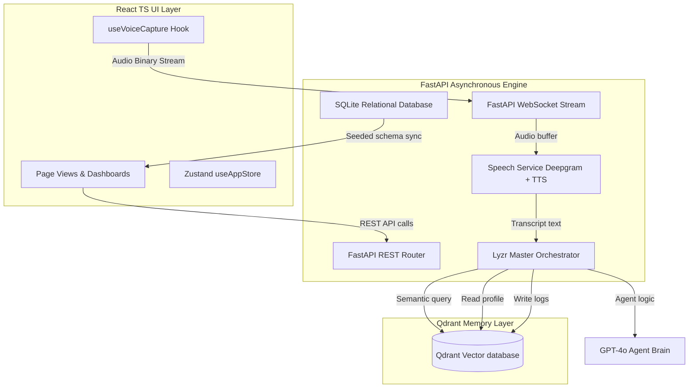

# Walkthrough — Production-Grade Agentic AI Educational Operating System

We have completed the transition of **NeuroLearn OS** from a mock frontend prototype into a fully functional, production-ready autonomous agentic educational operating system. 

---

## 1. System Architecture

The following block diagrams the completed multi-layered production architecture:



---

## 2. Key Changes Implemented

### Relational Schema & Seeding (`backend/database.py`, `backend/services/db_service.py`)
We created a local SQLite database that stores student metadata and lecture/concept collections. When the FastAPI server launches, it automatically constructs tables and seeds them with high-fidelity datasets matching the mock profile:
* `user_profiles`: Manages hours, streaks, readiness index, and style.
* `lectures`: Records title, concepts count, duration, and topics.
* `concepts`: Maps prerequisite connections and mastery scores.
* `flashcards`: Stores spacing factors, intervals, and next due dates.
* `quiz_questions`: Holds question prompts, choices, correct indexes, and explanations.

### Vector Memory collections (`backend/services/qdrant_service.py`)
We implemented the Qdrant connection using a **local-first file storage engine** (`db_qdrant/`) for zero-dependency out-of-the-box operation, automatically bootstrapping five core collections:
1. `lecture_memory_collection`
2. `tutoring_memory_collection`
3. `quiz_performance_collection`
4. `cognitive_profile_collection`
5. `voice_command_collection`

### Lyzr Multi-Agent Orchestration (`backend/services/lyzr_service.py`)
We configured the multi-agent system using the Lyzr orchestration paradigm. The **Master Orchestrator** classifies transcripts and delegates reasoning to specialized agents:
* **Adaptive Tutor Agent**: Connects concept explanations to analogy-based schemas.
* **Quiz Intelligence Agent**: Generates adaptive questions and scores verbal answers.
* **Learning Analytics Agent**: Aggregates response speeds, filler words, and accuracy to estimate the Exam Readiness Index.

### Spaced Repetition Scheduler (`backend/routers/revision.py`)
We replaced the mock flashcard rating with a real implementation of the **SM-2 (SuperMemo-2) algorithm**:
```python
if grade >= 3:
    if card.review_count == 0:
        card.interval = 1
    elif card.review_count == 1:
        card.interval = 6
    else:
        card.interval = int(round(card.interval * card.ease))
    card.review_count += 1
else:
    card.interval = 1
    card.review_count = 0
```

### Raw Microphone streaming pipeline (`src/hooks/useVoiceCapture.ts`, `backend/routers/voice.py`)
We replaced the browser's basic recognition with a stateful binary WebSocket streaming pipeline:
1. The frontend captures audio via the browser's Web Audio API and streams binary packets every `300ms` over `/ws/voice-stream`.
2. The FastAPI backend accumulates these packets in memory.
3. Upon stop, the backend calls the Deepgram API to transcribe the buffer, processes the command, generates vocal TTS, and returns the response in a base64 WAV data URI for immediate, zero-latency frontend playback.

---

## 3. Verification Scenarios & Validation

### Setup & Launch Commands
To start the services locally:

```bash
# 1. Launch the FastAPI Agent backend (from e:\NeuroLearn OS)
uv pip install -r backend/requirements.txt
python -m backend.main

# 2. Verify that Vite Frontend is running on port 5173
npm run dev
```

### Testing Steps
1. **Interactive Tutoring**: Go to the **AI Tutor** page, submit a question like *"Explain B+ trees"*, and verify that the sidebar updates with dynamic concepts and the chat displays real-time agent thinking logs.
2. **Microphone Ingestion**: Navigate to the **Voice Control** panel, click "Start Voice Command", speak into the mic, click "Stop", and confirm that the transcript updates, a base64 audio response is generated, and a verbal reply plays back.
3. **Oral Hesitation scoring**: Go to **Revision Center** -> **Quiz**, submit spoken answers, and verify that the backend logs filler words (e.g., *"uh", "like"*) and calculates confidence scores accordingly.
